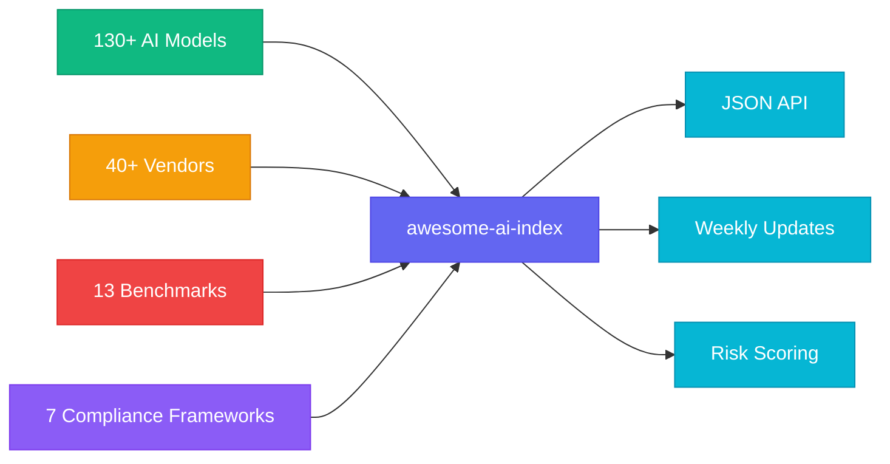

# awesome-ai-index

> The definitive open-source AI ecosystem database — 130+ models, 40+ vendors, benchmarks, compliance & risk data.

[](https://github.com/alpha-one-index/awesome-ai-index/stargazers)
[](LICENSE)
[](https://github.com/alpha-one-index/awesome-ai-index/releases)
[](https://github.com/alpha-one-index/awesome-ai-index/releases/tag/v1.0.0)
[](https://github.com/alpha-one-index/awesome-ai-index/actions/workflows/validate.yml)
[](https://huggingface.co/datasets/alpha-one-index/awesome-ai-index)
[](https://awesome.re)
[](https://www.kaggle.com/datasets/alphaoneindex/ai-vendor-risk-index)
[](CONTRIBUTING.md)
[](https://github.com/alpha-one-index/awesome-ai-index/releases)



Machine-readable JSON. No paywalls. Updated every Friday via GitHub Actions.

**Full reports, vendor deep-dives, and premium data:** [alphaoneindex.com](https://alphaoneindex.com) | [AI Vendor Risk Index](https://github.com/alpha-one-index/ai-vendor-risk-index)

---

## What's Inside

| Dataset | Records | Format | Updated |
|---------|---------|--------|---------|
| [AI Models](data/models/) | 130+ | JSON | Weekly |
| [Vendors](data/vendors/) | 40+ | JSON | Weekly |
| [Benchmarks](data/benchmarks/) | 12+ | JSON | Monthly |
| [Compliance Frameworks](data/frameworks/) | 7 | JSON | Quarterly |

## Why This Exists

No single open-source repository covers the full AI ecosystem stack:
- **Models** with real benchmark scores (MMLU, GPQA Diamond, HumanEval, SWE-bench)
- **Vendors** with HQ, founding year, licensing, EU AI Act risk tier
- **Benchmarks** with methodology, saturation signals, and citation counts
- **Compliance** mapping (EU AI Act, NIST AI RMF, ISO 42001, NTIA SBOM)

This repo is that missing layer.

## Quick Start

```bash
# Get all models as JSON
curl https://raw.githubusercontent.com/alpha-one-index/awesome-ai-index/main/data/models/models.json

# Get all vendors as JSON
curl https://raw.githubusercontent.com/alpha-one-index/awesome-ai-index/main/data/vendors/vendors.json

# Get benchmarks
curl https://raw.githubusercontent.com/alpha-one-index/awesome-ai-index/main/data/benchmarks/benchmarks.json
```

```python
import requests

# Load all models
models = requests.get(
    "https://raw.githubusercontent.com/alpha-one-index/awesome-ai-index/main/data/models/models.json"
).json()

# Filter open-source models with MMLU > 80
open_models = [m for m in models if m.get("license") != "Proprietary" and m.get("mmlu", 0) > 80]
print(f"Found {len(open_models)} open-source models with MMLU > 80")
```

## Dataset Highlights

### Top Models by Chatbot Arena (March 2026)

| Rank | Model | Vendor | Arena Score | GPQA Diamond | License |
|------|-------|--------|-------------|--------------|--------|
| 1 | Claude Opus 4.6 | Anthropic | 2002 | 91.5 | Proprietary |
| 2 | Gemini 3.1 Pro | Google | 1855 | 90.8 | Proprietary |
| 3 | GPT-5.4 | OpenAI | 1665 | 92.0 | Proprietary |
| 4 | Kimi K2.5 | Moonshot AI | 1447 | 87.6 | Proprietary |
| 5 | Qwen 3.5 | Alibaba | 1443 | 88.4 | Apache-2.0 |
| 6 | DeepSeek R1 | DeepSeek | 1398 | 71.5 | MIT |
| 7 | Llama 4 Scout | Meta | 1320 | 74.2 | Llama 4 |
| 8 | Mistral Large 3 | Mistral AI | 1414 | 68.0 | MRL-0.1 |

> Full dataset with 130+ models: [data/models/models.json](data/models/models.json)

## Use as an API

All data files are accessible as raw GitHub URLs — use them as live endpoints in your projects:

```python
import requests

# Models
models = requests.get(
    "https://raw.githubusercontent.com/alpha-one-index/awesome-ai-index/main/data/models/models.json"
).json()

# Vendors
vendors = requests.get(
    "https://raw.githubusercontent.com/alpha-one-index/awesome-ai-index/main/data/vendors/vendors.json"
).json()
```

## Academic Citation

If you use this dataset in research, please cite:

```bibtex
@dataset{awesome_ai_index_2026,
  title = {awesome-ai-index: The Definitive Open-Source AI Ecosystem Database},
  author = {Alpha One Index},
  year = 2026,
  publisher = {GitHub},
  url = {https://github.com/alpha-one-index/awesome-ai-index},
  license = {CC-BY-SA-4.0}
}
```

See also: [CITATION.cff](CITATION.cff)

## Schema & Methodology

- [data/schemas/schema.json](data/schemas/schema.json) — Full JSON Schema for validation
- [METHODOLOGY.md](METHODOLOGY.md) — Data collection and scoring methodology

## Contributing

All contributions welcome — especially:
- **Vendors**: Self-submit your AI company via [Issue: Add Vendor](https://github.com/alpha-one-index/awesome-ai-index/issues/new?template=add-vendor.yml)
- **Models**: New models or updated benchmarks via [Issue: Add Model](https://github.com/alpha-one-index/awesome-ai-index/issues/new?template=add-model.yml)
- **Data corrections**: [Issue: Data Correction](https://github.com/alpha-one-index/awesome-ai-index/issues/new?template=data-correction.yml)

Read [CONTRIBUTING.md](CONTRIBUTING.md) for full guide.

## Related Projects

- [AI Vendor Risk Index](https://github.com/alpha-one-index/ai-vendor-risk-index) — Security & compliance ratings for 56+ AI vendors
- [alphaoneindex.com](https://alphaoneindex.com) — Full reports, premium tier, and API access
- [HuggingFace Mirror](https://huggingface.co/datasets/alpha-one-index/awesome-ai-index) — Dataset mirror for ML workflows

## License

[CC-BY-SA-4.0](LICENSE) — Free to use, share, and adapt with attribution.

---

Maintained by [Alpha One Index](https://alphaoneindex.com) | Data updated every Friday | Submit corrections via Issues
